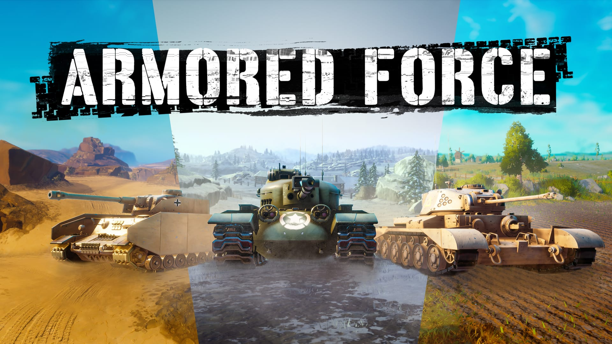

# Armored Force

In this team based tank shooter, two teams of tank commanders compete for control of the enemies’ territory. Exhaust your foes with fast and maneuverable light tanks, breach enemy lines with all-purpose medium tanks, use the force of heavy tanks to eliminate opposing armored forces, or become a sniper with long-range destroyers. Earn experience, upgrade your tanks and unlock new ones. More maps, modes and mayhem coming soon!

## Project Structure

Armored Force consists of x games, each of those are in their respective top level folder of the project:

- Armored Force, the main game.
- Tanks Garage GIT
- Tanks_PORTAL_IMAGES_1
- Tanks_PORTAL_IMAGES_2
- Tanks_PORTAL_IMAGES_3
- TW_Map1
- TW_Map2
- TW_Map3
- TW_MapTest

## Disclaimer

This project is being released as-is and targetted towards more advanced users. It does not reflect current best practices nor is it perfectly optimized, please keep that in mind.

## Credits

Armored Force was created via the hard work of these Core creators:

- META Director: Buckmonster
- Design Leads: Buckmonster, Bigglebuns
- Inspiration, Design, Last Minute Changes: Basilisk
- Producer: Rolok
- Associate Producer: Jarsa
- Lead Developer: Estlogic
- Lead tank artist: AwkwardGameDev
- Support Developer: Datonare, Morticai, Burnzie, Ooccoo, Grimland, Blaking707
- Tank AI Developer: Chris
- Map design and creation: Keppu, AwkwardGameDev
- UI design and art: Konz from Legacynet Media
- QA: Aj
- Support Designer: Mucusinator
- Additional Art, UI: WitcherSilver

## CC Components

- Cinematic Shot (Standardcombo)
- EaseUI (NicholasForeman)

## Feedback & Support

Please use GitHub issues or our [thread on the Core Forums](https://forums.coregames.com/t/armored-force/2031) for feedback and support.

## Contributing

If you are interested in fixing issues and contributing directly to the code base, please see our [contributing guidelines](CONTRIBUTING.md).

## License

Licensed under the [Apache License 2.0](LICENSE) license.
